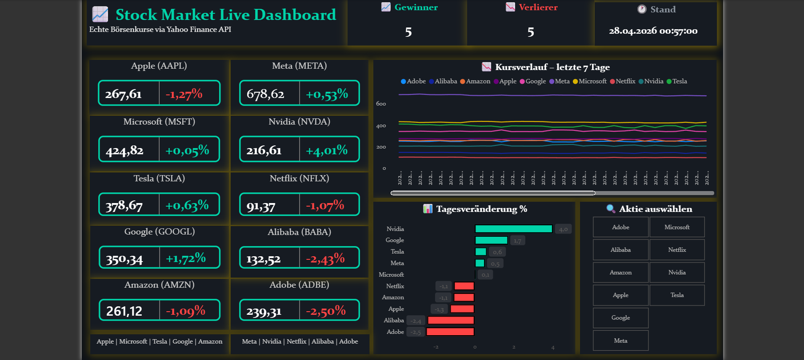

# 📈 Stock Market Live Dashboard



## 🎯 Projektbeschreibung
Live-Dashboard mit echten Börsenkursen via 
Yahoo Finance API – automatisch stündlich aktualisiert.

## 🛠️ Tech Stack
- **Python** – Datenabruf & Bereinigung
- **yfinance** – Yahoo Finance API
- **Pandas** – Datenverarbeitung
- **Power BI** – Dashboard & Visualisierung
- **DAX** – Berechnungen & bedingte Formatierung
- **Windows Task Scheduler** – Automatisierung

## 📊 Features
- ✅ 10 Top-Aktien live (Apple, Tesla, Nvidia...)
- ✅ Stündliche automatische Aktualisierung
- ✅ Grün/Rot bedingte Formatierung
- ✅ Kursverlauf letzte 7 Tage
- ✅ 30+ DAX Measures
- ✅ Interaktiver Slicer

## 🏢 Verfolgte Aktien
| Kürzel | Firma |
|--------|-------|
| AAPL | 🍎 Apple |
| MSFT | 🪟 Microsoft |
| TSLA | 🚗 Tesla |
| GOOGL | 🔍 Google |
| AMZN | 📦 Amazon |
| META | 👤 Meta |
| NVDA | 🎮 Nvidia |
| NFLX | 🎬 Netflix |
| BABA | 🛒 Alibaba |
| ADBE | 🎨 Adobe |

## 🔄 Wie es funktioniert

Yahoo Finance API
↓
fetch_stocks.py (Daten holen)
↓
clean_stocks.py (Daten bereinigen)
↓
stocks_sauber.csv (für Power BI)
↓
Power BI Dashboard (Live!)

## 🚀 Installation

### 1. Repository klonen
```bash
git clone https://github.com/Borisy-94/StockMarketDashboard
```

### 2. Libraries installieren
```bash
pip install yfinance pandas
```

### 3. Daten abrufen
```bash
python scripts/fetch_stocks.py
python scripts/clean_stocks.py
```

### 4. Power BI öffnen

data/Stock Market Live Dashboard.pbix

## 📁 Projektstruktur

StockMarketDashboard/
├── 📁 scripts/
│   ├── fetch_stocks.py      ← API Abruf
│   ├── clean_stocks.py      ← Bereinigung
│   └── update_stocks.py     ← Automatisierung
├── 📁 data/
│   ├── stocks_sauber.csv
│   └── stocks_verlauf_sauber.csv
├── 📁 screenshots/
│   └── dashboard_final.png
└── README.md

## 👨‍💻 Autor
**Boris Petamba**
- LinkedIn: linkedin.com/in/borispetamba
- GitHub: github.com/Borisy-94
- Email: borispetamba@gmail.com
